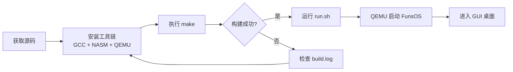

# FunsCore v0.6 / FunsOS — 从零构建的完整 x86 操作系统

<p align="center">
  
  
  
  
  
</p>

<p align="center">
  <strong>完全从零编写的 x86 32 位操作系统内核及完整用户态环境</strong><br/>
  <em>A fully from-scratch, feature-rich x86 32-bit operating system kernel with complete userland</em>
</p>

---

**版权所有 (c) 2025-2026 Funs Liu. All Rights Reserved.**
Copyright (c) 2025-2026 Funs Liu. All Rights Reserved.

---

## 项目简介

**FunsCore** 是本项目操作系统的内核名称（当前版本 **v0.6**），**FunsOS** 是基于 FunsCore 构建的完整操作系统名称。这是一个从零开始、不依赖任何现有操作系统代码的 **x86 32 位操作系统项目**，使用 **C 语言和 x86 汇编语言**编写。

FunsOS 实现了现代操作系统的核心子系统，包括：进程调度与多任务管理、虚拟内存管理（VMM）、11 种文件系统支持、完整的 TCP/IP 网络协议栈、VBE 图形帧缓冲控制台与 3D 软件渲染器、窗口管理与合成器、音频系统、安全防护机制、KVM 虚拟化支持、内嵌数据库引擎 FunDB、完整的用户认证系统以及丰富的驱动程序框架。

该项目旨在展示操作系统底层原理，同时提供一个可实际运行、具备图形桌面环境的完整操作系统。

---

## 特性概览

### 内核核心

| 特性 | 描述 |
|------|------|
| **进程调度器** | 抢占式多任务调度，支持时间片轮转、优先级调度、CFS 公平调度策略 |
| **内存管理** | 物理内存页框分配 (PMM)、内核堆分配 (kheap)、伙伴系统算法 |
| **虚拟内存** | 页表映射、写时复制 (COW)、按需分页、内存映射文件 (mmap)、交换分区 (swap) 支持 |
| **系统调用** | 200+ 系统调用接口，通过 int 0x80 / sysenter 快速进入内核态 |
| **SMP 多核支持** | AP 启动引导、核间中断 (IPI)、自旋锁/信号量同步原语 |
| **异常处理** | Page Fault、General Protection Fault、Double Fault 等完整异常处理链 |
| **中断管理** | 可编程中断控制器 (PIC/APIC)、8259 PIT 定时器中断 |
| **线程支持** | POSIX 线程接口实现，包含 TLS（线程本地存储）支持 |
| **信号机制** | Unix 风格信号处理：SIGKILL、SIGTERM、SIGSEGV 等 |
| **进程间通信** | 消息队列 (msg)、共享内存 (shm)、管道 (pipe) |
| **ELF 加载器** | 支持动态链接 ELF 可执行文件的加载与执行 |

### 文件系统 (11 种)

| 文件系统 | 描述 |
|----------|------|
| **RAMFS** | 内存文件系统，用于 `/tmp` 和临时数据存储 |
| **FAT32** | 兼容 MS-DOS/Windows 的 FAT32 文件系统，支持长文件名 |
| **EXT2** | Linux 经典 EXT2 文件系统读写支持 |
| **EXT4** | 现代 EXT4 文件系统，含日志 (journal) 回放功能 |
| **BTRFS** | B-tree 文件系统，支持快照和子卷 |
| **XFS** | 高性能 XFS 日志文件系统 |
| **DEVFS** | 设备文件系统，自动生成 `/dev` 下设备节点 |
| **PROCFS** | 进程信息文件系统 (`/proc`)，提供运行时系统状态 |
| **SYSFS** | 系统设备与驱动信息文件系统 (`/sys`) |
| **TARFS** | TAR 归档文件系统，用于 initrd 只读根文件系统 |
| **FUSE** | 用户空间文件系统框架，允许用户态实现自定义文件系统 |

**通用 VFS 层**：统一的虚拟文件系统抽象层，提供 `open/read/write/close/lseek/stat` 等 POSIX 兼容接口；支持目录项缓存 (dentry cache)、块缓存 (block cache) 和文件描述符管理。

### 网络协议栈

| 组件 | 描述 |
|------|------|
| **TCP/IP 协议栈** | 完整的 TCP、UDP、UDP-Lite、IP、ICMP、IGMP、ARP 实现 |
| **Socket 接口** | BSD Socket API 兼容，支持 TCP/UDP/RAW 三种套接字类型 |
| **NIC 驱动 (10 种)** | Intel E1000/8254x (I219/I225)、RTL8139/8169、PCNet/NE2000、Virtio-NET、ConnectX-3、Broadcom 57xx |
| **防火墙** | 基于 Netfilter 的包过滤防火墙，支持规则链和带宽限制 |
| **策略路由** | 多路由表、基于源地址/目标地址的路由选择 |
| **DNS 解析器** | 客户端 DNS 查询与缓存 |
| **DHCP 客户端** | 自动获取 IP 地址、网关、DNS 服务器配置 |
| **HTTP 客户端** | 内置 HTTP/1.1 客户端库，支持 GET/POST 请求 |
| **TFTP/NTP/Telnet** | TFTP 文件传输、NTP 时间同步、Telnet 远程终端 |
| **回环接口** | 本地网络回环测试支持 |

### 图形系统

| 组件 | 描述 |
|------|------|
| **VBE 帧缓冲控制台** | VESA BIOS Extensions (VBE) 模式设置，高分辨率帧缓冲控制台 |
| **2D 图形引擎 (GFX)** | 像素绘制、线条、矩形、圆、椭圆、多边形填充、Bezier 曲线 |
| **3D 软件渲染器 (GFX3D)** | 透视投影变换、Z-buffer 深度测试、Phong 光照模型、纹理映射 |
| **图像解码** | JPEG 和 PNG 格式解码支持（内置软件解码器） |
| **字体引擎** | FreeType-Mini 字体渲染，支持 TrueType 字体与 Unicode 文本 |
| **位图管理** | 像素级位图操作与 Blit 加速 |
| **窗口管理器** | 窗口创建/销毁/移动/调整大小、Z-order 管理、焦点管理 |
| **合成器** | Alpha 混合合成、窗口阴影、圆角窗口、硬件加速提示 |
| **光标管理** | 多种鼠标光标样式、热点定位、动画光标 |
| **主题系统** | 可切换的 UI 主题（颜色方案、字体、控件外观） |
| **显示服务器** | 图形显示服务协调层，统一管理帧缓冲输出 |

### 音频系统

| 组件 | 描述 |
|------|------|
| **Intel HDAudio** | High Definition Audio 总线驱动，支持多声道输出 |
| **AC97** | Audio Codec '97 兼容声卡驱动 |
| **Creative SB16** | Sound Blaster 16 ISA 声卡驱动 |
| **软件混音** | 多路音频流混合输出，音量控制 |

### 安全系统

| 特性 | 描述 |
|------|------|
| **Stack Canary** | 栈缓冲区溢出检测，编译时插入 canary 值验证 |
| **权限系统** | 完整 Unix 风格 rwx 权限模型 + ACL 扩展访问控制，文件/资源权限检查 |
| **用户角色体系** | 四级用户角色：Sover (uid=0, 超级管理员)、Admin (uid=1, 管理员)、User (普通用户)、Nobody (uid=65534, 匿名) |
| **密码认证** | 加盐密码哈希存储 (Salted Hash)，安全登录认证机制 |
| **用户持久化** | 用户/组数据持久化到 `/etc/passwd` 和 `/etc/group`，重启后保留 |
| **用户隔离** | 用户态/内核态严格隔离，Ring 0/Ring 3 保护环 |
| **保护系统** | 内存区域保护、代码段/数据段分离、执行保护 (NX bit) |
| **配额管理** | 用户磁盘配额限制与监控 |
| **文件锁** | POSIX 文件锁机制，防止并发写入冲突 |

### 虚拟化

| 特性 | 描述 |
|------|------|
| **KVM 多虚拟机** | Kernel-based Virtual Machine 支持，可同时运行多个 Guest OS |
| **VM 状态保存/恢复** | 虚拟机运行状态的快照保存与恢复加载 |
| **ACPI 睡眠** | ACPI S3 (Sleep/Suspend to RAM) 电源管理支持 |

### 数据库引擎 - FunDB

| 特性 | 描述 |
|------|------|
| **B-tree 索引** | 高效的 B-tree 索引结构，支持范围查询 |
| **SQL 解析器** | 内嵌 SQL 语法解析器，支持 SELECT/INSERT/UPDATE/DELETE |
| **WAL 事务** | Write-Ahead Logging 事务日志，保证 ACID 特性 |
| **持久化存储** | 数据持久化到文件系统，崩溃恢复能力 |

### 用户系统

| 特性 | 描述 |
|------|------|
| **四类角色** | Sover（超级管理员）、Admin（管理员）、User（普通用户）、Nobody（匿名） |
| **密码认证** | 密码哈希存储与登录认证 |
| **持久化** | 用户数据持久化到磁盘，重启后保留 |
| **登录服务** | 图形界面登录服务 (login_service) |

### 驱动系统

| 类别 | 驱动列表 |
|------|----------|
| **PCI 自动探测** | PCI 设备枚举、BAR 映射、IRQ 分配 |
| **USB/XHCI** | USB Core + xHCI 主机控制器、HID 设备（键盘/鼠标）、USB 大容量存储 |
| **NVMe** | NVMe PCIe 固态硬盘驱动 |
| **AHCI/IDE** | SATA AHCI 控制器和 IDE/PATA 并口驱动 |
| **GPU** | Intel i915、AMD GPU、DRM (Direct Rendering Manager) 框架 |
| **GPIO** | 通用输入输出端口驱动 |
| **看门狗** | 硬件看门狗定时器驱动 |
| **硬件随机数** | 硬件随机数生成器驱动 |
| **键盘/鼠标** | PS/2 键盘与鼠标驱动，支持多国键盘布局 |
| **RTC/PIT/Serial** | 实时时钟、可编程间隔定时器、串口 (COM1/COM2) 输出 |

### 上层应用

| 组件 | 描述 |
|------|------|
| **桌面环境** | 完整图形桌面，带壁纸、图标、右键菜单 |
| **任务栏** | 底部任务栏，显示已打开窗口、开始菜单、系统托盘、时钟 |
| **开始菜单** | 应用程序启动菜单，分类显示已安装应用 |
| **文件管理器** | 图形化文件浏览与管理工具 |
| **终端模拟器** | 命令行 Shell 终端窗口 |
| **文本编辑器** | 图形化文本编辑应用 |
| **画板** | 简单绘图应用程序 |
| **计算器** | 基础算术计算器 |
| **贪吃蛇** | 经典贪吃蛇游戏 |
| **Shell 命令行** | 内置 Shell 解释器，支持管道、重定向、后台任务 |
| **用户态工具集** | cat/cp/mv/rm/ls/mkdir/touch/grep/head/wc/date/echo/ifconfig/ping/top/wget 等常用命令 |
| **通知服务** | 系统通知弹出与消息中心 |
| **设置面板** | 系统设置与偏好配置 |

---

## 系统架构

```
funsos/
├── boot/                      # 引导程序
│   ├── boot.asm               #   第一阶段引导 (MBR, 512 bytes)
│   ├── stage2.asm             #   第二阶段引导 (进入保护模式, 加载内核)
│   ├── loader.asm             #   内核加载器
│   ├── linker.ld              #   内核链接脚本
│   ├── multiboot.h            #   Multiboot 规范头文件
│   └── boot_info.h            #   引导信息传递结构体
│
├── kernel/                    # 内核核心源码
│   ├── main.c                 #   内核入口 main() 函数
│   ├── entry.asm              #   内核汇编入口 (_start)
│   ├── interrupt.asm          #   中断处理汇编桩
│   ├── smp_trampoline.asm     #   SMP AP 核心启动跳板代码
│   ├── gdt.c/h                #   全局描述符表 (GDT)
│   ├── idt.c/h                #   中断描述符表 (IDT)
│   ├── sched.c/h              #   进程调度器
│   ├── process.c/h            #   进程/线程管理
│   ├── thread.c/h             #   线程管理 (pthread)
│   ├── vmm.c/h                #   虚拟内存管理
│   ├── vmm_cow.c/h            #   写时复制 (Copy-on-Write)
│   ├── pmm.c/h                #   物理内存管理
│   ├── kheap.c/h              #   内核堆分配器
│   ├── mmap.c/h               #   内存映射 (mmap)
│   ├── swap.c/h               #   交换分区管理
│   ├── page_replace.c/h       #   页面替换算法
│   ├── syscall.c/h            #   系统调用分发
│   ├── syscall_impl.c/h       #   系统调用具体实现
│   ├── sys_api.c/h            #   系统 API 封装层
│   ├── exception.c/h          #   CPU 异常处理
│   ├── irq.c/h                #   IRQ 中断请求管理
│   ├── interrupt.c/h          #   中断处理框架
│   ├── timer.c/h              #   可编程定时器 (PIT)
│   ├── smp.c/h                #   对称多处理 (SMP)
│   ├── spinlock.c/h           #   自旋锁同步原语
│   ├── sync.c/h               #   同步原语 (信号量/互斥锁)
│   ├── signal.c/h             #   信号处理机制
│   ├── pipe.c/h               #   管道 IPC
│   ├── ipc_msg.c/h            #   消息队列 IPC
│   ├── ipc_shm.c/h            #   共享内存 IPC
│   ├── elf.c/h                #   ELF 可执行文件加载器
│   ├── fpu.c/h                #   FPU 浮点单元管理
│   ├── tls.c/h                #   线程本地存储
│   ├── acpi.c/h               #   ACPI 电源管理
│   ├── acpi_sleep.c/h         #   ACPI 睡眠/唤醒
│   ├── kvm.c/h                #   KVM 虚拟化管理
│   ├── vmstate.c/h            #   VM 状态保存/恢复
│   ├── user.c/h               #   用户管理系统
│   ├── user_persist.c/h       #   用户数据持久化
│   ├── permission.c/h         #   权限控制系统
│   ├── protection.c/h         #   内存保护系统
│   ├── quota.c/h              #   配额管理
│   ├── flock.c/h              #   文件锁
│   ├── fundb.c/h              #   FunDB 数据库引擎
│   ├── config.c/h             #   系统配置解析
│   ├── c_interpreter.c/h      #   C 语言解释器
│   ├── editor.c/h             #   内核内建编辑器
│   ├── shell.c/h              #   内核 Shell
│   ├── shell_error.c/h        #   Shell 错误处理
│   ├── gui_apps.c/h           #   GUI 应用注册
│   ├── display_server.c/h     #   显示服务器
│   ├── driver_manager.c/h     #   驱动管理器
│   ├── disk_manager.c/h       #   磁盘管理器
│   ├── pkgmgr.c/h             #   包管理器
│   ├── fw_cmd.c/h             #   防火墙命令接口
│   ├── logrotate.c/h          #   日志轮转
│   ├── syslog.c/h             #   系统日志
│   ├── klog.c/h               #   内核日志
│   ├── panic.c/h              #   内核恐慌处理
│   ├── fb_console.c/h         #   帧缓冲控制台
│   ├── font_engine.c/h        #   字体渲染引擎
│   ├── unicode.c/h            #   Unicode 处理
│   ├── fs_layout.c/h          #   文件系统布局定义
│   ├── initrd.c/h             #   初始 ramdisk
│   ├── ext_mem.c/h            #   扩展内存探测
│   ├── battery.c/h            #   电池状态监测
│   ├── cpufreq.c/h            #   CPU 频率调节
│   ├── bios_edit.c/h          #   BIOS 编辑
│   ├── mini_sdl.c/h           #   Mini SDL 兼容层
│   ├── version.h              #   版本号定义
│   ├── kernel_types.h         #   内核公共类型定义
│   ├── kernel_mem.h           #   内核内存布局
│   ├── kernel_proc.h          #   内核进程结构
│   └── io.h                   #   端口 I/O 宏定义
│
├── fs/                        # 文件系统
│   ├── vfs.c/h                #   虚拟文件系统 (VFS) 核心层
│   ├── fat32.c/h              #   FAT32 文件系统
│   ├── ext2.c/h               #   EXT2 文件系统
│   ├── ext4.c/h               #   EXT4 文件系统
│   ├── ext4_journal.c/h       #   EXT4 日志回放
│   ├── btrfs.c/h              #   Btrfs 文件系统
│   ├── xfs.c/h                #   XFS 文件系统
│   ├── ramfs.c/h              #   RAM 内存文件系统
│   ├── devfs.c/h              #   设备文件系统
│   ├── procfs.c/h             #   进程信息文件系统
│   ├── sysfs.c/h              #   系统信息文件系统
│   ├── tarfs.c/h              #   TAR 归档文件系统
│   ├── fuse.c/h               #   用户空间文件系统
│   ├── path.c/h               #   路径解析
│   ├── dentry.c/h             #   目录项缓存
│   ├── cache.c/h              #   块缓存
│   ├── file_desc.c/h          #   文件描述符管理
│   ├── buffer.h               #   缓冲区头定义
│   └── block_cache.h          #   块缓存头定义
│
├── net/                       # 网络协议栈
│   ├── net.c/h                #   网络子系统的初始化与管理
│   ├── ethernet.c/h           #   以太网帧处理
│   ├── arp.c/h                #   ARP 地址解析协议
│   ├── ip.c/h                 #   IPv4 协议
│   ├── icmp.c/h               #   ICMP 协议 (ping)
│   ├── igmp.c/h               #   IGMP 组播管理
│   ├── tcp.c/h                #   TCP 传输协议
│   ├── tcp_state.c/h          #   TCP 状态机
│   ├── udp.c/h                #   UDP 协议
│   ├── udp_lite.c/h           #   UDP-Lite 协议
│   ├── socket.c/h             #   BSD Socket 接口
│   ├── loopback.c/h           #   回环网络接口
│   ├── route.c/h              #   路由表管理
│   ├── dhcp.c/h               #   DHCP 客户端
│   ├── dns.c/h                #   DNS 解析器
│   ├── http_client.c/h        #   HTTP 客户端
│   ├── tftp.c/h               #   TFTP 客户端
│   ├── telnet.c/h             #   Telnet 客户端
│   ├── ntp.c/h                #   NTP 时间同步
│   ├── raw_sock.c/h           #   Raw Socket 支持
│   ├── netfilter.c/h          #   Netfilter 防火墙框架
│   ├── fw.c/h                 #   防火墙规则引擎
│   ├── fw_bandwidth.c/h       #   带宽限制
│   ├── netstat.c/h            #   网络统计工具
│   ├── net_buf_pool.c/h       #   网络缓冲区池
│   ├── e1000.c/h              #   Intel E1000 NIC 驱动
│   └── rtl8139.c/h            #   RTL8139 NIC 驱动
│
├── drivers/                   # 硬件驱动
│   ├── pci.c/h                #   PCI 总线枚举与配置
│   ├── keyboard.c/h           #   PS/2 键盘驱动
│   ├── keyboard_map.h         #   键盘扫描码映射表
│   ├── mouse.c/h              #   PS/2 鼠标驱动
│   ├── vesa.c/h               #   VESA VBE 显卡驱动
│   ├── vga_text.c/h           #   VGA 文本模式驱动
│   ├── pit.c/h                #   8259 PIT 定时器
│   ├── rtc.c/h                #   RTC 实时时钟
│   ├── serial.c/h             #   串口驱动
│   ├── ide.c/h                #   IDE/PATA 硬盘驱动
│   ├── ahci.c/h               #   SATA AHCI 驱动
│   ├── ramdisk.c/h            #   Ramdisk 虚拟磁盘
│   ├── gpio.c/h               #   GPIO 通用 I/O
│   ├── watchdog.c/h           #   看门狗定时器
│   ├── hw_rng.c/h             #   硬件随机数生成器
│   ├── audio/
│   │   ├── ac97.c/h           #     AC97 声卡驱动
│   │   └── sb16.c/h           #     Sound Blaster 16 驱动
│   ├── block/
│   │   └── nvme.c/h           #     NVMe SSD 驱动
│   ├── gpu/
│   │   ├── i915.c/h           #     Intel i915 GPU 驱动
│   │   ├── amd_gpu.c/h        #     AMD GPU 驱动
│   │   └── drm.c/h            #     DRM 子系统
│   ├── net/
│   │   ├── rtl8139.c/h        #     Realtek RTL8139
│   │   ├── rtl8169.c/h        #     Realtek RTL8169 Gigabit
│   │   ├── e1000.c/h          #     Intel PRO/1000 (参考实现)
│   │   ├── i219.c/h           #     Intel I219 (千兆)
│   │   ├── i225.c/h           #     Intel I225 (2.5GbE)
│   │   ├── pcnet.c/h          #     AMD PCnet-PCI II
│   │   ├── ne2000.c/h         #     NE2000 兼容网卡
│   │   ├── virtio_net.c/h     #     Virtio 网络设备
│   │   ├── connectx3.c/h      #     Mellanox ConnectX-3
│   │   └── b57.c/h            #     Broadcom 57xx
│   ├── usb/
│   │   └── usb.h              #     USB 定义头文件
│   ├── char/
│   │   └── char.h             #     字符设备接口
│   └── video/
│       └── video.h            #     视频设备接口
│
├── usb/                       # USB 子系统
│   ├── usb_core.c/h           #   USB Core 核心
│   ├── usb_hid.c/h            #   USB HID 人机接口设备
│   ├── usb_storage.c/h        #   USB 大容量存储
│   └── xhci.c/h               #   xHCI 主机控制器驱动
│
├── audio/                     # 音频子系统
│   ├── sound.c/h              #   音频核心混音与管理
│   └── hdaudio.c/h            #   Intel HDAudio 驱动
│
├── gui/                       # 图形用户界面
│   ├── gfx.c/h                #   2D 图形绘制引擎
│   ├── gfx3d.c/h              #   3D 软件渲染器
│   ├── window.c/h             #   窗口管理
│   ├── wm.c/h                 #   窗口管理器
│   ├── compositor.c/h         #   桌面合成器
│   ├── widget.c/h             #   控件系统
│   ├── font.c/h               #   字体渲染
│   ├── freetype_mini.c/h      #   FreeType Mini 字体库
│   ├── bitmap.c/h             #   位图操作
│   ├── cursor.c/h             #   光标管理
│   ├── theme.c/h              #   UI 主题
│   ├── png.c/h                #   PNG 图像解码
│   ├── jpeg.c/h               #   JPEG 图像解码
│   ├── window_server.c/h      #   窗口服务器
│   └── window_server.h        #   窗口服务器接口
│
├── lib/                       # 内核 C 运行库
│   ├── stdio.c/h              #   标准 I/O (printf/scanf/snprintf)
│   ├── stdlib.c/h             #   标准库 (atoi/itoa/rand/qsort/bsearch)
│   ├── string.c/h             #   字符串操作 (memcpy/memset/strlen/strcmp...)
│   ├── ctype.c/h              #   字符分类
│   ├── wchar.c/h              #   宽字符支持
│   ├── math.c/h               #   数学函数 (sin/cos/sqrt/fabs/pow)
│   ├── softdiv.c              #   软件除法
│   ├── crt0.s                 #   C 运行时启动代码
│   ├── setjmp.asm/h           #   setjmp/longjmp
│   ├── float.h                #   浮点常量
│   ├── limits.h               #   类型极限值
│   ├── stdarg.h               #   可变参数宏
│   ├── stdbool.h              #   bool 类型
│   ├── stddef.h               #   size_t/ptrdiff_t/NULL
│   ├── stdint.h               #   整型类型定义
│   ├── signal.h               #   信号定义
│   └── unistd.h               #   POSIX 符号
│
├── apps/                      # 内核内置应用
│   ├── init.c                 #   init 进程 (PID 1)
│   ├── shell.c                #   Shell 命令解释器
│   ├── desktop.c              #   桌面环境
│   ├── terminal.c             #   终端模拟器
│   ├── notepad.c              #   记事本
│   ├── paint.c                #   画板
│   ├── calc.c                 #   计算器
│   ├── snake.c                #   贪吃蛇游戏
│   ├── filemgr.c              #   文件管理器
│   ├── crt0.asm               #   用户态 CRT 启动代码
│   ├── user_syscall.h         #   用户态系统调用头文件
│   └── *.c                    #   其他内置命令 (cat/ls/cp/mv/rm/mkdir/echo...)
│
├── userland/                  # 用户态独立程序
│   ├── init.c                 #   用户态 init
│   ├── login.c                #   登录程序
│   ├── ifconfig.c             #   网络配置工具
│   ├── ping.c                 #   Ping 网络诊断
│   ├── top.c                  #   系统监视器
│   ├── virc.c                 #   虚拟终端
│   ├── wget.c                 #   文件下载工具
│   └── audio_player.c         #   音频播放器
│
├── os/                        # 操作系统上层组件
│   ├── desktop/
│   │   ├── desktop.c/h        #     桌面主逻辑
│   │   ├── start_menu.c/h     #     开始菜单
│   │   ├── taskbar.c/h        #     任务栏
│   │   └── window_mgr.c/h     #     窗口管理器
│   ├── apps/
│   │   ├── file_manager.c/h   #     文件管理器
│   │   ├── settings.c/h       #     系统设置
│   │   ├── terminal.c/h       #     终端
│   │   └── text_editor.c/h    #     文本编辑器
│   ├── services/
│   │   ├── login_service.c/h  #     登录服务
│   │   └── notification.c/h   #     通知服务
│   └── README.txt             #   OS 层说明
│
├── sdk/                       # 软件开发工具包 (SDK)
│   ├── include/               #   SDK 公共头文件 (10 个)
│   ├── lib/                   #   SDK 运行时库
│   ├── examples/              #   示例程序 (20+ 个)
│   ├── tools/                 #   开发辅助工具
│   └── docs/                  #   SDK 文档
│
├── renderer/                  # FunRender 独立渲染引擎
│   ├── include/               #   渲染引擎头文件 (10 个)
│   ├── src/                   #   渲染引擎源码 (17 个模块) (v0.6 扩展)
│   │   ├── canvas.c, context.c, widgets.c, widgets_extra.c,
│   │   ├── layout.c, theme.c, animation.c, events.c,
│   │   ├── compositor.c, input.c, text.c, window.c,
│   │   ├── effect.c, transform.c, font_ext.c, gpu_bridge.c, clipboard.c
│   ├── themes/                #   主题定义 (default/dark/light)
│   └── README.md              #   渲染引擎说明
│
├── tools/                     # 构建辅助工具
│   └── mkimg.py               #   磁盘镜像打包脚本
│
├── build/                     # 构建输出目录
│   ├── kernel.bin             #   最终内核二进制
│   ├── kernel.elf             #   内核 ELF (调试用)
│   └── os.img                 #   完整 OS 磁盘镜像
│
├── Makefile                   # 顶层 Makefile (mingw32-make)
├── run.sh / run.bat            # QEMU 启动脚本
├── debug.sh / debug.bat        # GDB 调试启动脚本
├── build.log                  # 构建日志
└── serial.log                 # 串口输出日志
```

---

## 构建说明

### 前置要求

| 工具 | 版本要求 | 用途 |
|------|----------|------|
| **GCC (GNU Compiler Collection)** | x86 32-bit 目标支持 | C 语言编译 (`gcc -m32`) |
| **NASM (Netwide Assembler)** | 2.x+ | x86 汇编编译 (`nasm -f elf32`) |
| **LD (GNU Linker)** | binutils 的一部分 | 内核链接 |
| **mingw32-make** 或 **make** | 任何版本 | 构建系统 |
| **QEMU** | 6.0+ (推荐 8.0+) | 模拟器/虚拟机运行环境 |
| **GDB** | 10.0+ | 调试器 (可选) |
| **Python 3** | 3.6+ | 磁盘镜像打包脚本 (`mkimg.py`) |

> **注意**: 本项目在 Windows (MinGW/MSYS2) 和 Linux 环境下均可构建。Makefile 使用 `mingw32-make` 兼容语法。

### 构建步骤

```bash
# 1. 获取源码
cd funsos/

# 2. 清理旧的构建产物 (可选)
mingw32-make clean

# 3. 构建 (编译所有源码，链接，生成 os.img)
mingw32-make -j$(nproc)

# Windows 下:
mingw32-make -j%NUMBER_OF_PROCESSORS%
```

构建过程依次完成：
1. **汇编引导程序** -> `boot/boot.bin`, `loader.bin`, `stage2.bin`
2. **编译内核源码** -> 所有 `.c` -> `.o`，`.asm` -> `.o`
3. **链接内核** -> `kernel.elf` -> `kernel.bin`
4. **打包磁盘镜像** -> `os.img` (通过 `mkimg.py`)

### 在 QEMU 中运行

```bash
# 使用提供的启动脚本
./run.sh          # Linux/MacOS
run.bat           # Windows

# 或手动启动 QEMU
qemu-system-i386 \
  -drive format=raw,file=build/os.img \
  -m 512M \
  -serial stdio \
  -enable-kvm \          # 如果宿主机支持 KVM (Linux)
  -smp cores=2           # 双核模式
```

### 使用 GDB 调试

```bash
# 方式一: 使用提供的调试脚本
./debug.sh    # Linux/MacOS
debug.bat     # Windows

# 方式二: 手动启动
# 终端 1: 启动 QEMU (等待 GDB 连接)
qemu-system-i386 -drive format=raw,file=build/os.img -m 512M -s -S

# 终端 2: 连接 GDB
gdb build/kernel.elf \
  -ex "target remote :1234" \
  -ex "break main" \
  -ex "continue"
```

---

## 快速开始

以下是从源码到运行 FunsOS 的完整步骤：



### 详细步骤:

1. **安装依赖**
   ```bash
   # Ubuntu/Debian
   sudo apt install gcc nasm qemu-system-x86 gdb make python3

   # Windows (MSYS2)
   pacman -S mingw-w64-i686-gcc nasm qemu-system-i386 gdb make python
   ```

2. **构建项目**
   ```bash
   cd d:\Software\Project\5
   mingw32-make clean && mingw32-make -j4
   ```

3. **启动操作系统**
   ```bash
   # 直接运行
   ./run.sh

   # 或指定更多参数
   qemu-system-i386 -drive format=raw,file=build/os.img -m 1024M -smp 4
   ```

4. **系统运行**
   - 启动后将显示 FunsOS 的图形桌面环境
   - 可打开终端、文件管理器、记事本等应用
   - 支持键盘/鼠标交互操作

---

## 开发指南

### 添加新功能

1. **添加新的系统调用**:
   - 在 `kernel/syscall_impl.c` 中实现具体逻辑
   - 在 `kernel/syscall.c` 中注册调用号
   - 在 `sdk/include/` 中添加对应的 SDK 头文件声明

2. **添加新的驱动程序**:
   - 在 `drivers/` 下创建对应子目录
   - 实现 `init()` / `read()` / `write()` / `ioctl()` 接口
   - 在 `kernel/driver_manager.c` 中注册驱动

3. **添加新的文件系统**:
   - 在 `fs/` 下创建新文件系统源码
   - 实现 VFS 接口 (`mount`/`umount`/`read`/`write`/`readdir`)
   - 在 `kernel/vfs.c` 中注册文件系统类型

4. **添加新的 GUI 应用**:
   - 使用 SDK 头文件 (`sdk/include/funsos.h`)
   - 参考 `sdk/examples/` 中的示例
   - 编译后放入 initrd 即可运行

### 编码规范

| 规范 | 说明 |
|------|------|
| **语言** | C99 标准 + GNU ASM 内联汇编 |
| **命名风格** | 函数/变量: snake_case; 宏定义: UPPER_SNAKE_CASE; 类型: _t 后缀 |
| **缩进** | 4 空格 (禁止 Tab) |
| **注释** | 中文注释为主，关键函数需有功能说明 |
| **错误处理** | 使用负值返回错误码，成功返回 0 或正值 |
| **内存管理** | 内核态使用 kmalloc/kfree; 用户态使用 malloc/free (SDK) |
| **并发安全** | 共享数据必须加锁 (spinlock/mutex); 关键区禁用中断 |

### 文件组织原则

- **`kernel/`** — 仅包含内核核心逻辑，不含任何硬件相关代码
- **`drivers/`** — 所有硬件驱动，按设备类别分子目录
- **`fs/`** — 所有文件系统实现，通过 VFS 统一接口
- **`net/`** — 网络协议栈，分层设计 (L2->L3->L4->Socket)
- **`gui/`** — 图形子系统，依赖 VBE/GFX 但独立于窗口管理
- **`lib/`** — 不依赖任何外部库的自实现 C 运行库

---

## 硬件要求

### 最低配置

| 项目 | 最低要求 |
|------|----------|
| **CPU** | x86 兼容处理器 (支持 Protected Mode) |
| **内存 (RAM)** | 256 MB |
| **磁盘空间** | 64 MB (最小根文件系统) |
| **显卡** | VESA VBE 2.0+ 兼容 (至少 800x600x32bpp) |
| **输入设备** | PS/2 或 USB 键盘 + 鼠标 |

### 推荐配置

| 项目 | 推荐规格 |
|------|----------|
| **CPU** | 双核 x86_64 (向下兼容 32-bit 模式) |
| **内存 (RAM)** | 512 MB - 1 GB |
| **显卡** | VESA VBE 3.0+ (1280x1024x32bpp 或更高) |
| **磁盘空间** | 256 MB+ |

### 支持的运行环境

| 环境 | 说明 |
|------|------|
| **QEMU (推荐)** | 完整支持所有功能，推荐用于开发和测试 |
| **VirtualBox** | 基本支持 (可能需要调整显存配置) |
| **VMware** | 基本支持 |
| **真实 x86 硬件** | 理论上支持大多数标准 PC 硬件 (需要测试) |
| **Bochs** | 支持 (适合低级调试) |

---

## 许可证

```
Copyright (c) 2025-2026 Funs Liu. All Rights Reserved.
版权所有 (c) 2025-2026 Funs Liu。

本项目为专有软件 (Proprietary Software)。
未经作者明确书面许可，不得将本项目的源代码、二进制文件或其衍生作品
用于商业用途、重新分发或公开发布。

For proprietary use only. All rights reserved.
No commercial redistribution without explicit written permission from the author.
```

---

## 致谢

本项目在开发过程中参考了以下开源项目和学术资源：

| 项目 | 参考内容 |
|------|----------|
| **JamesM's kernel development tutorials** | 内核基础架构 (GDT/IDT/ISR/Paging) |
| **OSDev.org Wiki** | x86 硬件规范、协议文档、最佳实践 |
| **Linux Kernel (source code)** | 文件系统/VFS 设计、网络协议栈架构、驱动模型 |
| **Redox OS** | 微内核设计理念、Rust-inspired 安全思想 |
| **HaikuOS** | 图形系统设计、响应式 UI 架构 |
| **FreeBSD** | 网络协议栈实现 (TCP/IP state machine) |
| **Tanenbaum's MINIX 3** | 微内核进程通信设计 |
| **Intel SDM (Software Developer's Manual)** | x86/x64 架构参考 |
| **UEFI Specification** | 引导协议参考 |
| **FreeType Project** | 字体渲染算法 (freetype_mini 基于 FreeType 2) |
| **libpng/libjpeg-turbo** | 图像格式解码算法参考 |
| **QEMU Project** | 虚拟化平台 (主要开发/测试平台) |

---

## 联系方式

| 方式 | 信息 |
|------|------|
| **作者** | Funs Liu |
| **作者主页** | [GitHub Repository](https://github.com/Funs-Sm) |
| **问题反馈** | 请提交 Issue 或 Pull Request |
| **邮箱** | ldp20000-2@outlook.com |

---

<p align="center">
  <strong>FunsCore v0.6 — 从零构建的 x86 操作系统</strong><br/>
  <em>FunsCore v0.6 — An operating system built from scratch</em>
</p>
